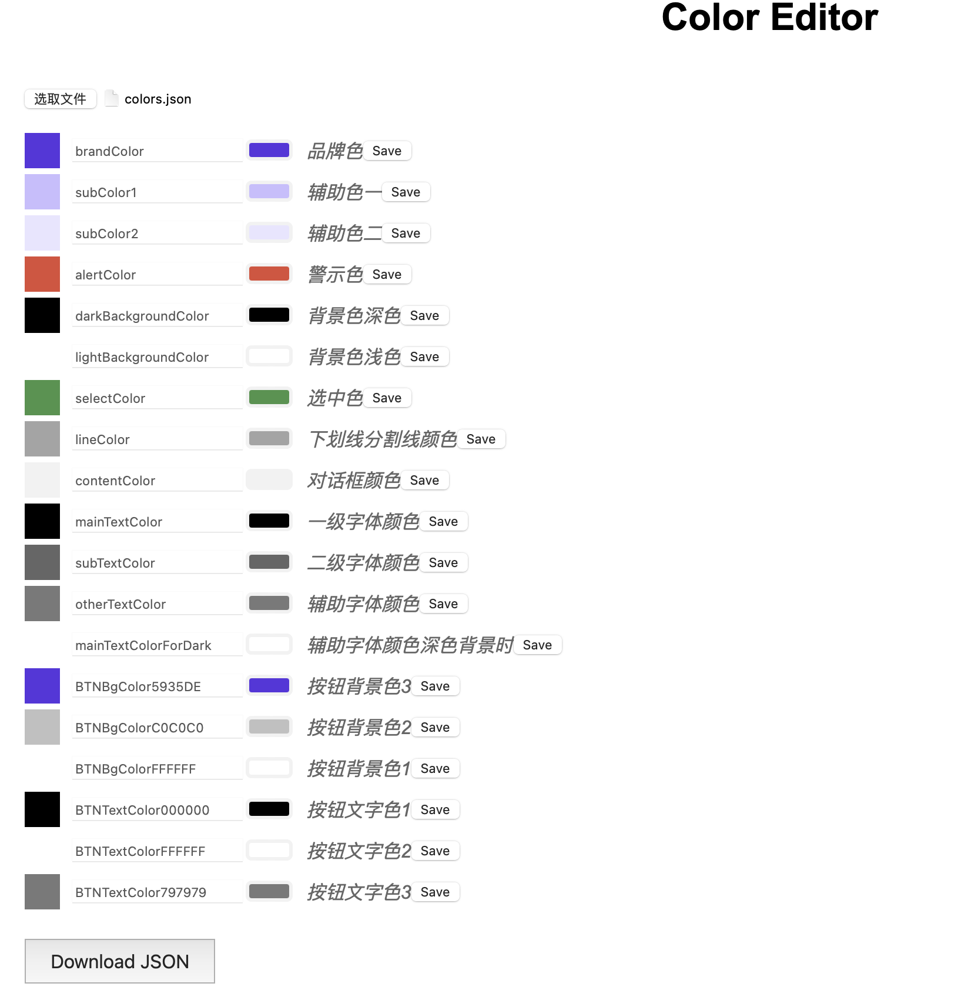

# 主体配色工具
1. 输入项：json文件 格式参照
```
{
  "colors": [
    { "name": "Red", "value": "#FF5733", "comment": "This is a warm color." },
    { "name": "Green", "value": "0x33FF57", "comment": "This is a fresh color." },
    { "name": "Blue", "value": "#3357FF", "comment": "This is a cool color." },
    { "name": "Yellow", "value": "#F1C40F", "comment": "This is a bright color." }
  ]
}
```
2. 网页编辑 方便UI替换色值*showColor.html*


3. pyhton3脚本*ColorCodeOutput*代码输出项：
输出MMAppTheme分类Color的h和m文件 可以直接在项目中使用

注意项
xcode项目内会有三个文件相关 
> color.json
> MMAppTheme+Color.h  
> MMAppTheme+Color.m

色值目前以兼容#开头或者0x开头

如需修改寻找关键词
output_m_file = 'MMAppTheme+Color.m'
output_h_file = 'MMAppTheme+Color.h'

相关宏
```
#define     HexColor(color)             [UIColor colorWithRed:((float)((color & 0xFF0000) >> 16))/255.0 green:((float)((color & 0xFF00) >> 8))/255.0 blue:((float)(color & 0xFF))/255.0 alpha:1.0]
#define     HexAColor(color, a)         [UIColor colorWithRed:((float)((color & 0xFF0000) >> 16))/255.0 green:((float)((color & 0xFF00) >> 8))/255.0 blue:((float)(color & 0xFF))/255.0 alpha:a]
```
